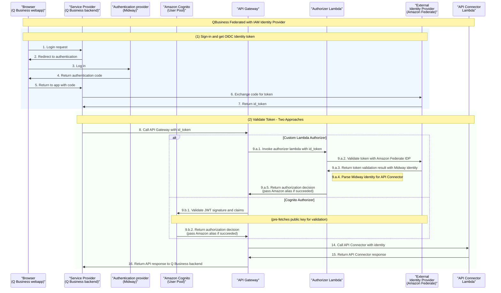

## Background

When implementing authorizer solutions for Amazon Q Business custom plugins, development teams often face a choice between two main approaches. This article compares AWS Cognito Authorizer and Custom Lambda Authorizer implementations, analyzing their differences in terms of performance, cost, security, and extensibility.

## What is Amazon Cognito?

Amazon Cognito is a fully managed identity service that provides user sign-up, sign-in, and access control capabilities for web and mobile applications. In the context of Amazon Q Business, Cognito serves as a crucial bridge between external identity providers and your custom plugins, enabling secure authentication and authorization for backend systems. 

Key capabilities include:
- Automatic handling of the complete OAuth2 flow
- Federation with external identity providers
- JWT token issuance and validation
- Integration with API Gateway's built-in authorizer using pre-cached public keys

## What is Custom Lambda Authorizer?

A Custom Lambda Authorizer is a serverless function that provides custom authentication and authorization logic for API Gateway, giving you complete control over the authentication process and allowing integration with any identity provider. 

The Lambda function:
- Receives raw tokens from API Gateway
- Validates tokens by fetching public keys from external IdPs (with caching)
- Applies custom business logic
- Returns IAM policy decisions

This approach offers maximum flexibility for complex authorization scenarios at the cost of increased implementation complexity and maintenance overhead.

## Authentication Flow

Both authorizers require an ID token to be fetched, so the user-side authentication UX and flows remain the same for both approaches.

### Step-by-Step Flow

1. **User Authorization**: User clicks "Authorize" in Q App Web Experience when invoking a custom plugin

2. **Authentication**: User authenticates via OpenID Connect to obtain ID token from Amazon's internal IDP
   - **Cognito Authorizer**:
     - Authorization URL: `https://xxxx.auth.us-east1.amazoncognito.com/oauth2/authorize`
     - Token URL: `https://xxxx.auth.us-east-1.amazoncognito.com/oauth2/token`
   - **Custom Lambda Authorizer**:
     - Authorization URL: `https://idp-integ.federate.amazon.com/api/oauth2/v1/authorize`
     - Token URL: `https://idp-integ.federate.amazon.com/api/oauth2/v2/token`

3. **API Gateway Call**: Backend calls API Gateway with ID token

4. **Token Validation**:
   - **Cognito Authorizer**: Cognito validates ID token with pre-fetched public key from Amazon Federate IDP and parses Midway identity
   - **Custom Lambda Authorizer**: Lambda validates ID token with Amazon Federate IDP, parses Midway identity, and returns authorization

5. **API Processing**: API Gateway calls API Connector with authorized request

6. **Response**: API Connector returns response to Q Business backend, which returns plugin results to frontend

## Detailed Comparison

| Aspect | Cognito Authorizer | Custom Lambda Authorizer |
|--------|-------------------|--------------------------|
| **User Experience** | User needs to login for plugin in cards | User needs to login for plugin in cards |
| **Latency** | Less than 500ms (typically) | ~1200ms when cache misses, negligible when cache hits |
| **Security** | Good - Cognito handles public key fetching and rotation | Good - Leverages Amazon Federate official SDK (Federate-oidc-oauth2-sdk) |
| **Extensibility** | Limited to token and claim authentication | Full authorization extensibility - can add resource-level authorization |
| **Cost (10k MAU)** | $150/month for 10k MAU ($0.015 per MAU above 50 MAU) | $65.58/month for 10k MAU at 5 TPS |
| **Scalability** | Cognito manages public key fetching and rotation automatically | Cached calls to federate IDP (15-minute cache), no scalability issues |
| **IAM Identity Center** | Support unclear | Support unclear |

## Cost Analysis Deep Dive

### Custom Lambda Authorizer Cost Calculation

**Assumptions:**
- Traffic: 5 TPS = 12,960,000 API calls/month
- MAU: 10,000 users
- Lambda Configuration: 1GB memory, 1000ms average execution time

**Cache Performance (with API Gateway Cache):**
- 70% cache hit: 3,888,000 Lambda invocations/month
- 85% cache hit: 1,944,000 Lambda invocations/month  
- 95% cache hit: 648,000 Lambda invocations/month

**Lambda Costs (70% cache hit scenario):**
- Invocations: 3,888,000 × $0.20/million = $0.78
- Compute: 3,888,000 × 1s × 1GB × $0.0000166667 = $64.80
- **Total: $65.58/month**

## Performance Considerations

### API Gateway Authorizer Cache

API Gateway uses the authorizer's identity sources (headers like Authorization, query strings, stage variables) as the cache key. When a request arrives with identical identity parameters within the TTL, the cached authorizer response is reused instead of invoking the Lambda authorizer again.

This caching mechanism significantly improves performance for Custom Lambda Authorizers, making them competitive with Cognito's built-in performance.

## When to Choose Each Option

### Choose Cognito Authorizer When:
- You need simple token-based authentication
- You want minimal maintenance overhead
- You prefer AWS-managed solutions
- Cost is less of a concern for your use case

### Choose Custom Lambda Authorizer When:
- You need custom authorization logic beyond token validation
- You require resource-level authorization
- You want to implement complex business rules
- Cost optimization is important (significantly cheaper for high-volume scenarios)
- You need fine-grained control over the authorization process

## Conclusion

For Amazon Federate IDP implementations, **Custom Lambda Authorizer is currently the preferred choice** due to its extensibility for additional authorization logic and better cost efficiency at scale. The ability to implement resource-level authorization (e.g., "user kevinxu has seller mapping to seller ABC for search seller authorization") provides significant value over simple token validation.

However, the choice ultimately depends on your specific requirements:
- If you need simple authentication with minimal maintenance, Cognito Authorizer is sufficient
- If you need extensibility and cost efficiency, Custom Lambda Authorizer is the better choice

For potential IAM Identity Center support, both options require further evaluation as the compatibility landscape continues to evolve.

## References

- AMTool Amazon Q plugin LLD
- AM Assistant - Amazon Q
- [AWS Cognito Pricing](https://aws.amazon.com/cognito/pricing/)
- [AWS Lambda Pricing](https://aws.amazon.com/lambda/pricing/)

---

*This comparison is based on real-world implementations by ISG and AMC tech teams for Amazon Q Business custom plugins.*
